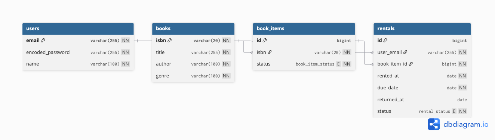

# Book Rental API

전자 도서관의 회원, 도서, 개별 도서 재고 및 대여/반납을 관리하기 위한 REST API 프로젝트입니다.

## 기술 스택

* Java 21
* Spring Boot
* Spring JDBC
* Spring Security PasswordEncoder
* MySQL 8.0
* JUnit 5
* Mockito
* Gradle

## 주요 기능

* 회원가입 및 로그인
* 비밀번호 암호화 저장
* 도서 등록 및 조회
* 제목 / 저자 / 장르 기반 도서 검색
* 페이지네이션
* 개별 도서(BookItem) 재고 관리
* 도서 대여 및 반납
* 연체 상태 관리
* 동시 대여 시 재고 정합성 보호

## ERD



## Database Design

### Book과 BookItem 분리

`books`는 ISBN, 제목, 저자, 장르와 같은 도서 정보를 관리합니다.

`book_items`는 실제로 대여할 수 있는 개별 도서 한 권을 나타냅니다.

따라서 동일한 ISBN의 책을 5권 보유하는 경우:

* `books`: 1개의 데이터
* `book_items`: 5개의 데이터

로 관리합니다.

### 재고 관리

`books` 테이블에 전체 수량이나 대여 가능 수량을 별도로 저장하지 않습니다.

실제 `book_items` 데이터를 기준으로 수량을 계산하여, 별도의 수량 컬럼과 개별 도서 상태 간의 데이터 불일치 가능성을 줄였습니다.

대여 가능 수량은 `AVAILABLE` 상태의 BookItem 개수로 계산합니다.

### Rental

대여는 Book이 아닌 실제 개별 도서인 `BookItem`을 대상으로 합니다.

`rentals`는 다음 관계를 가집니다.

* User 1 : N Rental
* Book 1 : N BookItem
* BookItem 1 : N Rental

하나의 BookItem은 시간에 따라 여러 번 대여될 수 있지만 동시에 하나의 활성 대여만 가질 수 있습니다.

Rental 상태:

* `RENTED`: 정상 대여 중
* `OVERDUE`: 반납 예정일이 지난 대여
* `RETURNED`: 반납 완료

`RENTED`와 `OVERDUE`는 모두 아직 반납되지 않은 활성 대여로 처리합니다.

### 비밀번호 저장

사용자의 비밀번호는 평문으로 저장하지 않습니다.

회원가입 시 `PasswordEncoder`를 사용해 암호화한 후 `encoded_password` 컬럼에 저장합니다.

## 동시성 및 상태 정합성

BookItem 대여 시 현재 상태가 `AVAILABLE`인 경우에만 `RENTED`로 변경하도록 조건부 UPDATE를 사용합니다.

```sql
UPDATE book_items
SET status = 'RENTED'
WHERE id = ?
  AND status = 'AVAILABLE';
```

동시에 여러 요청이 같은 BookItem을 대여하려는 경우 UPDATE된 행의 개수를 기준으로 실제 대여 성공 여부를 판단할 수 있도록 설계했습니다.

반납 역시 현재 상태가 `RENTED`인 BookItem에 대해서만 수행합니다.

Rental의 연체 상태는 `RENTED` 상태이면서 `due_date`가 현재 날짜보다 이전인 데이터만 `OVERDUE`로 변경합니다.

## API

| Method | URL                          | Description |
| ------ | ---------------------------- | ----------- |
| POST   | `/users/signup`              | 회원가입        |
| POST   | `/users/login`               | 로그인         |
| GET    | `/books/search`              | 도서 검색       |
| GET    | `/books/{bookId}`            | 도서 상세 조회    |
| POST   | `/rentals`                   | 도서 대여       |
| GET    | `/rentals/me`                | 내 대여 목록     |
| PATCH  | `/rentals/{rentalId}/return` | 도서 반납       |

## 테스트

DAO는 실제 데이터베이스와의 연동을 검증하고, Service는 Mockito를 이용해 단위 테스트합니다.

주요 테스트 항목:

* 회원가입 시 비밀번호 암호화 여부
* 중복 이메일 가입 방지
* 로그인 성공 / 실패
* 도서 검색 및 페이지네이션
* 중복 ISBN 등록 방지
* BookItem 대여 / 반납 상태 변경
* 이미 대여 중인 BookItem 재대여 방지
* Rental 반납 및 연체 상태 변경
* 존재하지 않는 데이터 조회 예외 처리

## 실행 방법

### 1. 실행 환경

다음 환경이 필요합니다.

* Java 21
* Docker
* Git

Gradle Wrapper를 사용하므로 별도의 Gradle 설치는 필요하지 않습니다.

### 2. 프로젝트 Clone

```bash
git clone <repository-url>
cd book-rental-api
```

### 3. MySQL 실행

```bash
docker run \
  --name book_rental \
  -e MYSQL_ROOT_PASSWORD=your_password \
  -p 3306:3306 \
  -d mysql:8.0
```

### 4. 데이터베이스 생성

```bash
docker exec -e MYSQL_PWD="your_password" book_rental \
  mysql -u root -e "CREATE DATABASE book_rental CHARACTER SET utf8mb4 COLLATE utf8mb4_unicode_ci;"
```

### 5. Schema 적용

```bash
docker exec -i -e MYSQL_PWD="your_password" book_rental \
  mysql -u root book_rental < schema.sql
```

테이블 확인:

```bash
docker exec -e MYSQL_PWD="your_password" book_rental \
  mysql -u root -D book_rental -e "SHOW TABLES;"
```

다음 테이블이 생성되면 정상입니다.

```text
books
book_items
rentals
users
```

### 6. 환경변수 설정

macOS / Linux:

```bash
export DB_URL="jdbc:mysql://localhost:3306/book_rental"
export DB_USERNAME="root"
export DB_PASSWORD="your_password"
```

### 7. 테스트 실행

```bash
./gradlew test
```

정상 실행 시:

```text
BUILD SUCCESSFUL
```

Gradle Wrapper 실행 권한이 없는 경우:

```bash
chmod +x gradlew
```

### 8. 애플리케이션 실행

```bash
./gradlew bootRun
```

기본 실행 주소:

```text
http://localhost:8080
```
