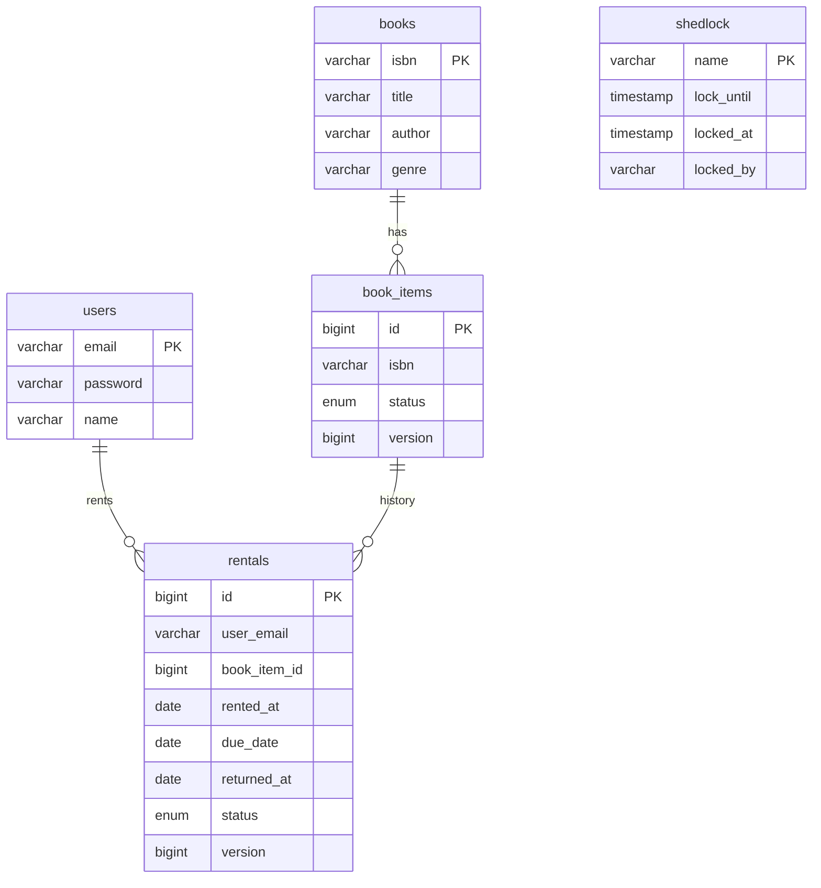

# Book Rental API

회원가입·로그인, 도서 검색, 개별 보유 도서의 대여·반납을 제공하는 REST API입니다. Spring Data JPA의 낙관적 락으로 동시 수정을 제어하고, 매일 연체 상태를 갱신합니다.

## 기술 스택

| 구분         | 기술                                           |
|--------------|------------------------------------------------|
| 언어·빌드    | Java 21, Gradle Wrapper                        |
| 애플리케이션 | Spring Boot 4.1.1, Spring MVC, Bean Validation |
| 인증         | Spring Security, BCrypt, JWT HS256             |
| 데이터       | Spring Data JPA, MySQL 8.0, Flyway             |
| 스케줄러     | Spring Scheduling, ShedLock JDBC 7.10.1        |
| 테스트       | JUnit Jupiter, Mockito, AssertJ, H2            |
| 실행 환경    | Docker, Docker Compose                         |

## 빠른 시작: Docker Compose

### 1. 사전 준비

- Git
- Docker Desktop 또는 Docker Engine + Docker Compose V2
- 최초 빌드 시 이미지·Gradle 의존성을 다운로드할 네트워크 연결
- 호스트의 사용 가능한 포트: API `8080`, MySQL `3307`

Docker 내부에서 Java 빌드와 MySQL 실행을 수행하므로 호스트에 JDK·Gradle·MySQL을 별도로 설치할 필요는 없습니다. 아래 명령은 macOS/Linux 셸 기준입니다. Windows
PowerShell에서는 파일 복사에 `Copy-Item .env.example .env`를 사용할 수 있습니다.

### 2. 저장소 복제 및 환경변수 준비

```bash
git clone https://github.com/king-junho/book-rental-api.git
cd book-rental-api
cp .env.example .env
```

`.env`를 열고 다음 값을 채웁니다. `.env.example`의 빈 값을 그대로 두지 않습니다.

| 변수                  | 설정할 값                                        |
|-----------------------|--------------------------------------------------|
| `DB_PASSWORD`         | 앱이 사용하는 MySQL `book_user` 계정 비밀번호    |
| `MYSQL_ROOT_PASSWORD` | MySQL 관리자 계정 비밀번호                       |
| `JWT_SECRET`          | 최소 32바이트의 무작위 키를 Base64로 인코딩한 값 |

OpenSSL이 있다면 다음 명령으로 JWT 키를 생성할 수 있습니다. 출력 문자열을 `JWT_SECRET` 값으로 입력합니다.

```bash
openssl rand -base64 32
```

실제 `.env`는 Git에 올리지 않습니다. `.env.example`만 공유하며, 개발자마다 자신의 값을 설정합니다. Compose는 `.env`의 값을 읽어 `compose.yaml`의 `${...}`를
치환하고 컨테이너에 전달합니다. IntelliJ 실행 설정과 `.env`는 자동 동기화되지 않습니다.

### 3. 빌드 및 실행

```bash
docker compose up -d --build
docker compose ps
docker compose logs --tail=100 app
```

앱 로그에 `Started RestServiceApplication`이 표시되고 시작 오류가 없는지 확인합니다. `docker compose ps`의 앱 `Up` 상태만으로 Spring 초기화 성공까지 보장되지는
않습니다.

실행 순서는 다음과 같습니다.

1. MySQL 컨테이너가 시작되고 새 볼륨에 DB와 계정이 초기화됩니다.
2. DB 상태 검사 통과 후 앱 컨테이너가 시작됩니다.
3. `docker` Spring 프로필에서 Flyway가 미적용 SQL을 실행합니다.
4. Hibernate가 Entity와 테이블 매핑을 검증합니다.
5. API가 `http://localhost:8080`에서 요청을 받습니다.

Dockerfile은 빌드 단계에서 `test bootJar`를 실행합니다. 테스트 실패 시 이미지 빌드도 실패합니다. 최종 실행 이미지는 Java 21 JRE와 `app.jar`를 사용합니다.

### 4. 접속 정보

| 대상                    | 주소·값                 |
|-------------------------|-------------------------|
| API                     | `http://localhost:8080` |
| 호스트의 DB 클라이언트  | `localhost:3307`        |
| 앱 컨테이너에서 DB 접속 | `db:3306`               |
| DB 이름                 | `book_rental`           |
| 앱 DB 계정              | `book_user`             |
| DB 비밀번호             | `.env`의 `DB_PASSWORD`  |

컨테이너 안의 `localhost`는 해당 컨테이너 자신입니다. 앱은 Compose 서비스 이름인 `db`로 MySQL에 연결합니다.

### 5. 종료·재실행

```bash
# 기존 이미지로 실행
docker compose up -d

# 소스 변경 후 다시 빌드하여 실행
docker compose up -d --build

# 로그 확인
docker compose logs -f app
docker compose logs --tail=100 db

# 컨테이너 종료 및 제거: DB 볼륨은 유지
docker compose down
```

MySQL 데이터는 이름 있는 볼륨 `mysql-data`에 보관됩니다. `docker compose down -v`는 DB 볼륨도 삭제하므로 데이터 전체 초기화를 의도할 때만 사용합니다.

이미 초기화된 볼륨에서는 `.env`의 MySQL 비밀번호만 바꿔도 DB 계정 비밀번호가 자동으로 변경되지 않습니다. JWT 키 변경 시 기존 토큰은 유효하지 않으므로 다시 로그인합니다.

## DB 초기화와 테스트용 도서

### 스키마 관리

초기 SQL은 [V1__create_tables.sql](src/main/resources/db/migration/V1__create_tables.sql)에 있습니다.

- 생성 테이블: `users`, `books`, `book_items`, `rentals`, `shedlock`
- Flyway는 `flyway_schema_history`에 적용 이력을 기록합니다.
- `docker` 프로필: Flyway 활성화, `ddl-auto=validate`
- 기본 프로필: Flyway 비활성화, `ddl-auto=none`
- H2 JPA 테스트: Hibernate의 `create-drop`으로 테이블 생성

Docker의 새 DB에는 Flyway를 사용합니다. 루트의 기존 `schema.sql`을 추가로 실행하지 않습니다. 이미 테이블이 존재하지만 Flyway 이력이 없는 DB에 적용하려면 스키마 확인과 별도
baseline 계획이 필요합니다. 적용한 마이그레이션을 수정하는 대신 다음 변경은 `V2__설명.sql`처럼 새 파일로 추가합니다.

### 도서 데이터 준비

새 DB에는 회원·도서 데이터가 없습니다. 회원가입 API로 사용자를 만들고, 도서는 아래 SQL로 준비할 수 있습니다. 현재 도서 등록 API는 없습니다.

```bash
docker compose exec db mysql -u book_user -p book_rental
```

비밀번호 프롬프트에 `.env`의 `DB_PASSWORD`를 입력한 뒤 MySQL 프롬프트에서 아래 SQL을 최초 한 번 실행합니다.

```sql
START TRANSACTION;

INSERT INTO books (isbn, title, author, genre)
VALUES ('TEST-001', '자바 입문', '테스트 저자', '프로그래밍');

INSERT INTO book_items (isbn, status, version)
VALUES ('TEST-001', 'AVAILABLE', 0),
       ('TEST-001', 'AVAILABLE', 0);

COMMIT;
```

같은 SQL을 반복하면 ISBN 중복 오류나 보유 도서 추가가 발생할 수 있으므로 최초 준비용으로 사용합니다. 이미 데이터가 있다면 먼저 조회합니다.

```sql
SELECT *
FROM books
WHERE isbn = 'TEST-001';
SELECT *
FROM book_items
WHERE isbn = 'TEST-001';
```

## API 명세

기본 URL은 `http://localhost:8080`입니다. JSON 요청에는 `Content-Type: application/json`을 사용합니다.

| 기능         | Method | Endpoint                     | 인증   | 성공 응답                |
|--------------|--------|------------------------------|--------|--------------------------|
| 회원가입     | POST   | `/users/signup`              | 불필요 | `201 Created`, 본문 없음 |
| 로그인       | POST   | `/users/login`               | 불필요 | `200 OK`, 토큰           |
| 도서 검색    | GET    | `/books/search`              | 불필요 | `200 OK`, 페이지         |
| 도서 상세    | GET    | `/books/{isbn}`              | 불필요 | `200 OK`, 도서 상세      |
| 대여         | POST   | `/rentals`                   | 필요   | `204 No Content`         |
| 내 대여 이력 | GET    | `/rentals/me`                | 필요   | `200 OK`, 배열           |
| 반납         | PATCH  | `/rentals/{rentalId}/return` | 필요   | `204 No Content`         |

### 인증 방식

로그인 결과의 `accessToken`을 아래 헤더에 넣습니다.

```http
Authorization: Bearer <accessToken>
```

Postman에서는 Authorization의 유형을 `Bearer Token`으로 선택하고 Token 칸에 토큰 문자열만 넣습니다. 공개 API를 확인할 때는 불필요한 토큰을 보내지 않습니다. 공개 경로라도
만료·변조된 Bearer 토큰을 보내면 인증 필터가 거부할 수 있습니다.

- JWT 서명 방식: HS256
- 기본 유효기간: 15분
- 발급자·대상: `book-rental-api`
- 사용자 식별자 `sub`: 이메일
- 세션을 사용하지 않는 stateless 인증
- 토큰 갱신 API는 현재 제공하지 않음

### 회원가입

```http
POST /users/signup
```

```json
{
  "email": "test@example.com",
  "password": "test-password",
  "name": "테스트 사용자"
}
```

세 필드는 필수이며 공백만 입력할 수 없습니다. 이메일 형식을 검증합니다. 비밀번호는 BCrypt 해시로 변환하여 `users.password`에 저장합니다.

성공: `201 Created`, 본문 없음. 중복 이메일: `409 DUPLICATE_EMAIL`.

### 로그인

```http
POST /users/login
```

```json
{
  "email": "test@example.com",
  "password": "test-password"
}
```

응답:

```json
{
  "accessToken": "<발급된 JWT>"
}
```

인증 정보 불일치: `401 INVALID_CREDENTIALS`.

### 도서 검색

```http
GET /books/search?type=TITLE&keyword=자바&page=0
```

| 파라미터  | 필수   | 설명                                 |
|-----------|--------|--------------------------------------|
| `type`    | 예     | `TITLE`, `AUTHOR`, `GENRE` 중 하나   |
| `keyword` | 예     | 선택한 필드에 포함되는 검색어        |
| `page`    | 아니요 | 0부터 시작하는 페이지 번호, 기본값 0 |

페이지 크기는 5로 고정되며 ISBN 오름차순으로 정렬합니다. 현재 API에 페이지 크기 변경 파라미터는 없습니다. `page`에는 0 이상의 값을 사용합니다.

```json
{
  "content": [
    {
      "isbn": "TEST-001",
      "title": "자바 입문",
      "author": "테스트 저자",
      "genre": "프로그래밍"
    }
  ],
  "page": 0,
  "size": 5,
  "totalElements": 1,
  "totalPages": 1
}
```

검색 결과가 없으면 `content`는 빈 배열이고 전체 건수는 0입니다.

### 도서 상세 조회

```http
GET /books/TEST-001
```

```json
{
  "isbn": "TEST-001",
  "title": "자바 입문",
  "author": "테스트 저자",
  "genre": "프로그래밍",
  "totalCount": 2,
  "availableCount": 2
}
```

권수는 `book_items`에서 계산합니다. 존재하지 않는 ISBN: `404 BOOK_NOT_FOUND`.

### 대여

```http
POST /rentals
Authorization: Bearer <accessToken>
```

```json
{
  "isbn": "TEST-001"
}
```

서버가 해당 ISBN의 대여 가능한 보유 도서 한 권을 선택합니다. 사용자는 JWT에서 식별하므로 이메일을 요청 본문에 보내지 않습니다.

성공: `204 No Content`, 본문 없음. 대여 가능한 보유 도서가 없으면 `409 BOOK_OUT_OF_STOCK`입니다. 현재는 존재하지 않는 ISBN의 대여 요청도 이 오류로 처리합니다.

대여일은 `Asia/Seoul` 기준 날짜이며 반납 예정일은 대여일의 14일 후입니다.

### 내 대여 이력

```http
GET /rentals/me
Authorization: Bearer <accessToken>
```

```json
[
  {
    "rentalId": 1,
    "bookItemId": 1,
    "rentedAt": "2026-10-10",
    "dueDate": "2026-10-24",
    "returnedAt": null,
    "status": "RENTED"
  }
]
```

날짜와 ID는 예시입니다. 반납 완료 기록도 포함하며 현재는 페이지 없는 배열 응답입니다. 이력이 없으면 `[]`를 반환합니다. 반환 순서는 별도로 보장하지 않습니다.

### 반납

```http
PATCH /rentals/1/return
Authorization: Bearer <accessToken>
```

요청 본문은 없습니다. 경로의 ID는 보유 도서 ID가 아닌 **대여 기록의 `rentalId`**입니다. 실제 ID는 `/rentals/me`에서 확인합니다.

성공: `204 No Content`, 본문 없음. 보유 도서는 `AVAILABLE`, 대여는 `RETURNED`로 변경되고 반납일이 기록됩니다.

### 오류 응답

업무 예외는 `ProblemDetail`에 `code`를 추가해 반환합니다. 예를 들어 재고가 없으면:

```json
{
  "type": "about:blank",
  "title": "Conflict",
  "status": 409,
  "detail": "대여 가능한 책의 재고가 없습니다.",
  "instance": "/rentals",
  "code": "BOOK_OUT_OF_STOCK"
}
```

| 상태 | 업무 오류 코드            | 의미                                |
|------|---------------------------|-------------------------------------|
| 401  | `INVALID_CREDENTIALS`     | 로그인 정보 불일치                  |
| 403  | `RENTAL_ACCESS_DENIED`    | 다른 사용자의 대여 반납 시도        |
| 404  | `BOOK_NOT_FOUND`          | 상세 조회 대상 도서 없음            |
| 404  | `RENTAL_NOT_FOUND`        | 반납 대상 대여 기록 없음            |
| 404  | `BOOKITEM_NOT_FOUND`      | 대여 기록이 참조하는 보유 도서 없음 |
| 409  | `DUPLICATE_EMAIL`         | 중복 이메일 가입                    |
| 409  | `BOOK_OUT_OF_STOCK`       | 대여 가능한 보유 도서 없음          |
| 409  | `RENTAL_ALREADY_RETURNED` | 이미 반납된 상태                    |
| 409  | `RENTAL_ALREADY_RENTED`   | 이미 대여된 보유 도서               |
| 500  | `INTERNAL_SERVER_ERROR`   | 처리되지 않은 서버 오류             |

요청 DTO 검증 실패 등의 MVC 오류는 400 계열 응답으로 처리되며 업무 오류의 `code`가 항상 붙는 것은 아닙니다. JWT 누락·만료 등의 인증 필터 오류 역시 위 업무 예외와 동일한 JSON 형식을
보장하지 않습니다.

## 테스트

### 로컬 JDK로 실행

Java 21이 필요하며 별도 Gradle 설치는 필요 없습니다. H2 기반 테스트는 MySQL 실행이나 `.env` 없이 수행합니다.

```bash
./gradlew test

# 특정 테스트 클래스만 실행
./gradlew test --tests 'kr.ac.hansung.kjh.bookrental.service.RentalServiceIntegrationTest'
```

macOS/Linux에서 Wrapper 실행 권한 오류가 나면 `sh ./gradlew test`를 사용할 수 있습니다. Windows에서는 `gradlew.bat test`를 사용합니다.

테스트 보고서: `build/reports/tests/test/index.html`

### Docker에서 확인

```bash
docker compose up -d --build
```

Dockerfile의 빌드 단계에서 테스트가 실행됩니다. 동일 입력의 빌드 캐시가 있으면 기존 성공 결과를 재사용할 수 있습니다. 테스트 실행을 포함해 캐시 없이 다시 빌드하려면:

```bash
docker build --no-cache -t book-rental-api:local .
```

### 검증 범위

| 테스트                  | 내용                                                             |
|-------------------------|------------------------------------------------------------------|
| Service 단위 테스트     | 인증, 회원가입, 도서 조회, 대여·반납의 분기와 DTO 변환           |
| RetryFacade 단위 테스트 | 낙관적 락 충돌 시 재시도 및 최종 예외 전파                       |
| Repository 테스트       | 검색·페이징, 이메일 조회, 재고 계산, 연체 갱신                   |
| Service 통합 테스트     | 실제 H2 저장, 반납 및 재대여 이력                                |
| 대여 동시성 테스트      | 한 권에 5개 요청 시 성공·대여 기록 1건                           |
| 반납 동시성 테스트      | 같은 대여에 2개 요청 시 성공 1건 및 버전 증가                    |
| ShedLock 통합 테스트    | 독립적인 두 Spring 컨텍스트가 공용 H2를 사용할 때 중복 실행 방지 |

동시성 테스트는 테스트 전체의 트랜잭션을 끄고 각 작업 스레드에서 서비스 트랜잭션을 실행합니다. 시작 신호를 맞추지만 모든 요청이 반드시 같은 버전을 읽는 것까지 보장하지는 않습니다. H2 결과가 MySQL의
락·격리 수준 동작을 모두 검증하는 것은 아닙니다.

## 구조와 설계

```text
controller → service → repository → MySQL
     DTO       Entity      JPA
```

- Controller: 요청 검증, 인증 사용자 식별, 응답 DTO 반환
- Service: 대여·반납 규칙과 트랜잭션 경계
- Repository: JPA 조회·저장 및 연체 벌크 UPDATE
- Entity: 도서·대여 상태 전이와 버전 관리
- Scheduler: 실행 시각과 ShedLock 적용, 연체 처리는 서비스에 위임

### 도서와 보유 도서 분리

`books`는 ISBN별 도서 정보를, `book_items`는 실제 대여 가능한 개별 한 권을 나타냅니다. 동일 ISBN을 5권 보유하면 `books` 1행과 `book_items` 5행을 저장합니다. 전체·대여
가능 권수는 보유 도서 행을 집계하므로 별도 수량 컬럼을 사용하지 않습니다.

### 인증 및 동시성

로그인은 `AuthenticationManager → DaoAuthenticationProvider → UserDetailsService / PasswordEncoder`를 통해 검증하고 JWT를 발급합니다. 이후
요청은 Resource Server의 JWT 검증을 거칩니다.

대여·반납은 `@Transactional`과 `BookItemEntity`, `RentalEntity`의 `@Version`을 사용합니다. 대여 충돌 시 Facade가 최초 시도 포함 최대 3회 시도하고 시도 사이에
500ms 대기합니다. 반납에는 별도 재시도가 없습니다.

### 연체 갱신

- 매일 `Asia/Seoul` 기준 자정 실행
- `RENTED`이며 미반납이고 `dueDate < 오늘`인 기록을 `OVERDUE`로 변경
- 벌크 UPDATE 시 `version`도 1 증가
- ShedLock 이름: `markOverdue`, 최소 10초·최대 60초
- 락 판단에는 DB 시간을 사용하고, 획득에 실패한 실행은 건너뜀

최대 락 시간은 작업 강제 종료 시간이 아닙니다. 작업이 60초를 넘으면 다른 실행이 락을 획득할 수 있으므로 실제 데이터량과 부하에 맞춘 시간 검증이 필요합니다. 자정에 앱이 꺼져 있던 경우의 즉시 보충 실행은
별도로 구현하지 않았습니다.

## ERD

아래 관계는 현재 모델의 **논리적 관계**입니다. Entity는 관계 ID를 기본 필드로 저장하며, 초기 마이그레이션에는 외래키 제약조건이 없습니다.


```mermaid
erDiagram
    users ||--o{ rentals: rents
    books ||--o{ book_items: has
    book_items ||--o{ rentals: history

    users {
        varchar email PK
        varchar password
        varchar name
    }
    books {
        varchar isbn PK
        varchar title
        varchar author
        varchar genre
    }
    book_items {
        bigint id PK
        varchar isbn
        enum status
        bigint version
    }
    rentals {
        bigint id PK
        varchar user_email
        bigint book_item_id
        date rented_at
        date due_date
        date returned_at
        enum status
        bigint version
    }
    shedlock {
        varchar name PK
        timestamp lock_until
        timestamp locked_at
        varchar locked_by
    }
```